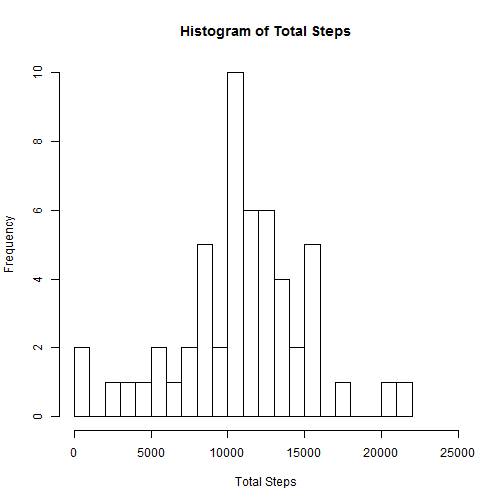
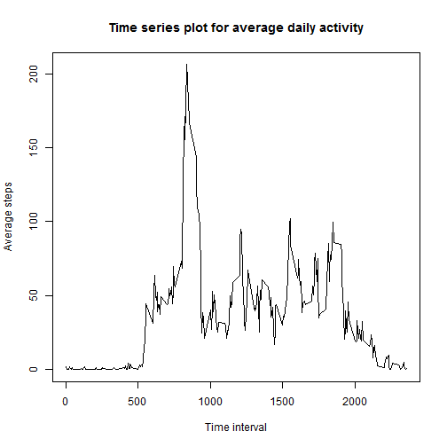
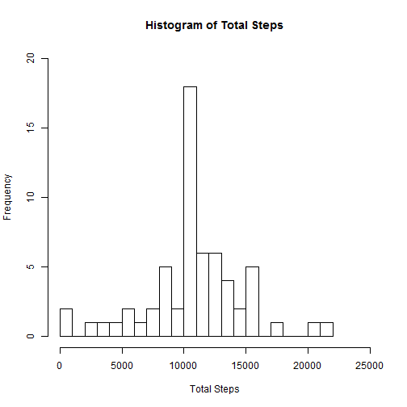
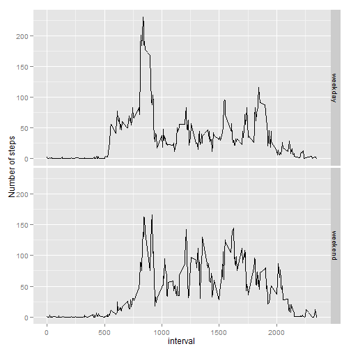

Reproducible Research: Peer Assessment 1
==========================================
Setting global options


```r
opts_chunk$set(echo=TRUE)
```


## Loading and preprocessing the data

Check to see if the activity.csv file already exists. If not, unzip the activity.zip file and read the activity.csv file into a dataframe.


```r
if (!file.exists("activity.csv"))
    unzip("activity.zip")  

    
activity_data <- read.csv("activity.csv")
head(activity_data)
```

```
##   steps       date interval
## 1    NA 2012-10-01        0
## 2    NA 2012-10-01        5
## 3    NA 2012-10-01       10
## 4    NA 2012-10-01       15
## 5    NA 2012-10-01       20
## 6    NA 2012-10-01       25
```

## What is mean total number of steps taken per day?


Part 1. The goal is to make a histogram of total number of steps taken each day. For this we will first use tapply to find the total and then use the base plotting system to create a histogram


```r
totalSteps <- tapply(activity_data$steps, activity_data$date, sum)
hist(totalSteps, breaks=20, xlab="Total Steps", main="Histogram of Total Steps", xlim=c(0,25000))
```

 

Part 2. To find mean and median of total steps taken each day. 


```r
mean(totalSteps, na.rm=TRUE)
```

```
## [1] 10766
```

```r
median(totalSteps, na.rm=TRUE)
```

```
## [1] 10765
```


## What is the average daily activity pattern?

Part 1
Here, we need to create a time series plot of the average steps (for each time interval) across all days. Using the aggregate function for steps against the time interval and plotting it using base plot


```r
intervalSteps <- aggregate(steps ~ interval, data=activity_data, FUN=mean, na.rm=TRUE)
head(intervalSteps)
```

```
##   interval   steps
## 1        0 1.71698
## 2        5 0.33962
## 3       10 0.13208
## 4       15 0.15094
## 5       20 0.07547
## 6       25 2.09434
```

```r
plot(intervalSteps, type="l", xlab = "Time interval", ylab = "Average steps", main = "Time series plot for average daily activity")
```

 

Part 2
Which interval has the highest mean steps


```r
intervalSteps$interval[which.max(intervalSteps$steps)]
```

```
## [1] 835
```
## Imputing missing values

Part 1. find the number of missing values


```r
sum(is.na(activity_data$steps))
```

```
## [1] 2304
```

Parts 2 and 3.Here we are required to impute missing values. For each missing value, I chose to substitute the mean for the corresponding interval. Using a for loop to run through the entire data structure and make the substitutions and create a new dataset which is the old dataset with NAs filled in. Taking the sum of all NA values to ensure that it is zero and all NAs have been substitussted.


```r
for (i in 1:length(activity_data$steps)){
  if (is.na(activity_data$steps[i])){
   
activity_data$steps[i] = intervalSteps$steps[which(intervalSteps$interval == activity_data$interval[i])]
  }
}
sum(is.na(activity_data$steps))
```

```
## [1] 0
```

```r
head(activity_data)
```

```
##     steps       date interval
## 1 1.71698 2012-10-01        0
## 2 0.33962 2012-10-01        5
## 3 0.13208 2012-10-01       10
## 4 0.15094 2012-10-01       15
## 5 0.07547 2012-10-01       20
## 6 2.09434 2012-10-01       25
```

Part 4. Create histogram and calculate mean/median of the new dataset and compare to old dataset


```r
totalSteps <- tapply(activity_data$steps, activity_data$date, sum)
hist(totalSteps, breaks=20, xlab="Total Steps", main="Histogram of Total Steps", xlim=c(0,25000), ylim = c(0, 20))
```

 

```r
mean(totalSteps)
```

```
## [1] 10766
```

```r
median(totalSteps)
```

```
## [1] 10766
```

The results do not show any change in mean and only a very small, almost insignificant change in median after imputing the NAs with the mean values of corresponding intervals

## Are there differences in activity patterns between weekdays and weekends?

Here we need to see if the patterns are different between weekday and weekends. First define a function to figure out if a day is a weekday or weekend and then calculate mean a time intervals for weekdays vd weekends and then plot the means.


```r
typeOfDay <- function(date){
  day <- weekdays(date)
  if (day %in% c("Monday", "Tuesday", "Wednesday", "Thursday", "Friday"))
    return("weekday")
  else
    return("weekend")
}

activity_data$date <- as.Date(activity_data$date)
activity_data$day <- sapply(activity_data$date, typeOfDay)

intervalSteps <- aggregate(steps ~ interval + day, data=activity_data, FUN=mean)

                           
library(ggplot2)
ggplot(intervalSteps, aes(interval, steps)) + geom_line() + facet_grid(day ~ .) + ylab("Number of steps")
```

 
